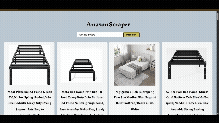

# Amazon Product Scraper

Este projeto realiza a extração de listagens de produtos da Amazon a partir da primeira página de resultados de busca. No backend, é utilizado o Bun, Express, Axios e JSDOM para criar uma API que retorna título, avaliação, número de reviews e URL da imagem de cada produto. No frontend, é usado Vite com HTML, CSS e JavaScript para uma interface simples, responsiva e moderna.

---

## Features

- Busca de produtos por palavra-chave  
- Extração de dados:  
  - Título do produto  
  - Avaliação (0 a 5 estrelas)  
  - Quantidade de avaliações  
  - URL da imagem do produto  
- Endpoint RESTful `/api/scrape` com parâmetro `?keyword=`  
- Rota de healthcheck `/ping`  
- Tratamento de erros no backend e no frontend  
- Arquitetura modular seguindo princípios SOLID  
- Guia de testes com Vitest e Supertest  

---

## Tecnologias

### Backend  
- Bun  
- Express  
- Axios  
- JSDOM  

### Frontend  
- Vite  
- HTML, CSS, JavaScript  

---

## Estrutura do Projeto

```
amazon-scraper/
├── backend/
│   ├── src/
│   │   ├── index.js       # Servidor Bun + Express + rotas
│   │   └── scraper.js     # Lógica de scraping com Axios + JSDOM
│   ├── package.json
│   └── bun.lock
├── frontend/
│   ├── public/
│   │   └── project-gif.gif
│   ├── index.html         # Marcações da página
│   ├── main.js            # Fetch AJAX e renderização dinâmica
│   └── style.css          # Estilos responsivos
├── README.md
└── .gitignore
```

---

## Como rodar o projeto

### Pré-requisitos

- Bun instalado (você pode usar `curl -fsSL https://bun.sh/install | bash`)  
- Node.js + npm (para o frontend via Vite)  

### 1. Clone do repositório

```bash
git clone https://github.com/seu-usuario/amazon-scraper.git
cd amazon-scraper
```

### 2. Instalação e execução do backend

```bash
cd backend
bun install
bun src/index.js
```

O servidor irá subir em `http://localhost:3000`.  
Verifique healthcheck:
```bash
curl http://localhost:3000/ping
# resposta: pong
```

### 3. Instalação e execução do frontend

```bash
cd ../frontend
npm install
npm run dev
```

Acesse `http://localhost:5173` no navegador.

---

## Backend em detalhes

### src/index.js

- Cria uma aplicação Express servida pelo Bun  
- Rota `/ping` para healthcheck  
- Rota `/api/scrape?keyword=palavra` que:  
  1. valida presença de `keyword`  
  2. chama `scrapeAmazon(keyword)`  
  3. retorna JSON com array de produtos  
  4. trata exceções, devolvendo status 500 com mensagem e stack  

### src/scraper.js

- Função `scrapeAmazon(keyword)` que:  
  1. monta URL de busca na Amazon  
  2. faz requisição GET via Axios com cabeçalhos realistas (User-Agent, Accept-Language)  
  3. usa JSDOM para parsear o HTML retornado  
  4. seleciona elementos de listagem de produto  
  5. extrai título, avaliação, quantidade de reviews e URL da imagem  
  6. devolve array de objetos  

---

## Frontend em detalhes

### index.html

- Campo de pesquisa e botão de disparo  
- Container onde os cards de produto serão injetados dinamicamente

### main.js

- Escuta clique no botão  
- Lê valor do campo de pesquisa  
- Faz `fetch("/api/scrape?keyword=" + encodeURIComponent(keyword))`  
- Trata resposta e erros  
- Renderiza cards com título, avaliação, reviews e imagem  

### style.css

- Layout flexível para grid de cards  
- Responsividade mobile-first  
- Design limpo e legível  

---

## API Endpoints

| Endpoint               | Método | Descrição                              | Parâmetros          |
|------------------------|--------|----------------------------------------|---------------------|
| /ping                  | GET    | Verifica se o serviço está funcionando | —                   |
| /api/scrape            | GET    | Retorna dados de produtos da Amazon    | `keyword` (string)  |

Resposta de `/api/scrape` (200):
```json
[
  {
    "title": "Produto Exemplo",
    "rating": 4.5,
    "reviews": 123,
    "imageUrl": "https://..."
  },
  ...
]
```

Erro de requisição (400, 500):
```json
{ "error": "mensagem descritiva" }
```

---

## Tratamento de erros

- Validação de query params com retorno 400  
- `try/catch` no handler para capturar falhas internas  
- Logs em console com `console.error` para rastreamento  
- No frontend, mensagens de feedback em tela  

---

## Testes

Recomenda-se usar Vitest e Supertest para testar:

- Rota `/ping` (deve retornar pong)  
- `/api/scrape` com `keyword` válido (mock de HTML com Nock)  
- Requisição sem `keyword` (deve retornar 400)  
- Erro no scraper (deve retornar 500)  
- Renderização de cards no frontend (Vitest + DOM Testing Library)  

---

## Limitações e próximos passos

- Scraping real sofre bloqueios (503) pela Amazon  
- Em produção, usar proxies, rotação de User-Agent e delays  
- Alternativa oficial: Product Advertising API da Amazon  
- Cache de resultados para evitar consultas repetidas  
- Monitoramento de métricas e logs estruturados  

---
## Imagem e funcionamento do site


## Observações finais

Este projeto serve como prova de conceito e atende requisitos do case técnico. Ajustes serão necessários para uso em produção, especialmente na camada de scraping e tratamento de bloqueios.
